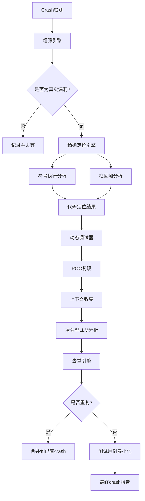
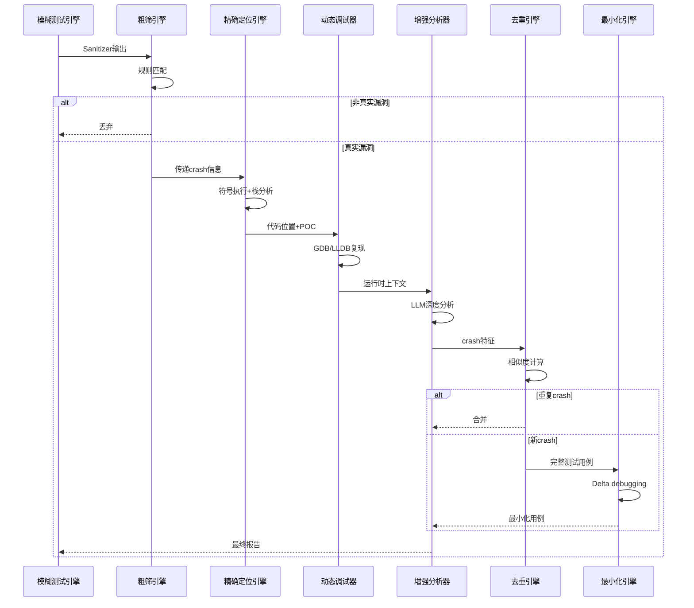

# 设计文档：增强型Crash分析系统

## 概述

本设计文档描述了对现有模糊测试crash分析模块的全面增强。当前系统仅提供基本的crash分类和LLM分析，但存在误判率高、定位不精确、缺乏去重和测试用例最小化等问题。增强型系统将引入粗筛机制、精确代码定位、动态调试器集成、上下文关联分析、crash去重和测试用例最小化功能，显著减少人工分析工作量并提高分析质量。

系统将采用多阶段分析流程：首先通过规则引擎进行粗筛，过滤掉模糊驱动本身的质量问题；然后通过符号执行和栈回溯进行精确定位；接着使用动态调试器复现crash并收集运行时上下文；最后通过相似度算法进行去重，并使用delta debugging最小化测试用例。

## 系统架构



## 主要工作流程




## 核心组件和接口

### 组件1：粗筛引擎 (CrashTriageEngine)

**目的**：快速过滤掉非真实漏洞的crash，减少后续分析负担

**接口**：
```python
class CrashTriageEngine:
    def triage_crash(self, crash_info: CrashInfo) -> TriageResult:
        """
        对crash进行粗筛
        
        Args:
            crash_info: 包含sanitizer输出、栈信息、信号类型等
            
        Returns:
            TriageResult: 包含is_real_bug、confidence、evidence等字段
        """
        pass
    
    def add_rule(self, rule: TriageRule) -> None:
        """添加新的粗筛规则"""
        pass
    
    def get_evidence(self, crash_info: CrashInfo) -> List[Evidence]:
        """收集支持判断的证据"""
        pass
```

**职责**：
- 应用规则引擎判断crash是否为真实漏洞
- 识别模糊驱动本身的问题（如未初始化变量、错误的API使用）
- 检测sanitizer特定的误报模式
- 收集支持判断的证据（栈特征、内存访问模式等）

### 组件2：精确定位引擎 (PreciseLocator)

**目的**：将crash定位到具体的代码行和代码片段

**接口**：
```python
class PreciseLocator:
    def locate_crash_site(self, crash_info: CrashInfo, binary_path: str) -> LocationResult:
        """
        精确定位crash发生的代码位置
        
        Args:
            crash_info: crash信息
            binary_path: 二进制文件路径
            
        Returns:
            LocationResult: 包含文件路径、行号、函数名、代码片段
        """
        pass
    
    def analyze_stack_trace(self, stack_trace: str) -> List[StackFrame]:
        """解析并增强栈回溯信息"""
        pass
    
    def get_code_context(self, location: CodeLocation, context_lines: int = 10) -> str:
        """获取crash位置周围的代码上下文"""
        pass
```

**职责**：
- 解析sanitizer输出中的地址信息
- 使用addr2line或llvm-symbolizer进行符号化
- 提取crash点的源代码片段
- 分析调用栈并识别关键帧

### 组件3：动态调试器集成 (DynamicDebugger)

**目的**：通过POC复现crash并收集运行时信息

**接口**：
```python
class DynamicDebugger:
    def reproduce_crash(self, poc_path: str, binary_path: str) -> ReproductionResult:
        """
        使用POC复现crash
        
        Args:
            poc_path: POC文件路径
            binary_path: 目标二进制路径
            
        Returns:
            ReproductionResult: 包含是否成功、运行时信息等
        """
        pass
    
    def collect_runtime_context(self, breakpoint: CodeLocation) -> RuntimeContext:
        """在crash点收集运行时上下文"""
        pass
    
    def trace_execution(self, poc_path: str) -> ExecutionTrace:
        """跟踪执行路径"""
        pass
```

**职责**：
- 使用GDB/LLDB自动化复现crash
- 在crash点收集变量值、寄存器状态
- 回溯调用栈并检查每一帧的状态
- 记录执行路径和关键分支决策


### 组件4：增强型分析器 (EnhancedCrashAnalyzer)

**目的**：整合所有信息进行深度分析

**接口**：
```python
class EnhancedCrashAnalyzer:
    def analyze_with_context(
        self, 
        crash_info: CrashInfo,
        location: LocationResult,
        runtime_context: RuntimeContext,
        triage_result: TriageResult
    ) -> EnhancedAnalysis:
        """
        使用完整上下文进行深度分析
        
        Args:
            crash_info: 原始crash信息
            location: 精确定位结果
            runtime_context: 运行时上下文
            triage_result: 粗筛结果
            
        Returns:
            EnhancedAnalysis: 包含root cause、修复建议、严重程度等
        """
        pass
    
    def generate_llm_prompt(self, all_context: Dict) -> str:
        """生成增强的LLM提示"""
        pass
    
    def extract_root_cause(self, analysis: str) -> RootCause:
        """从分析中提取根本原因"""
        pass
```

**职责**：
- 整合粗筛、定位、调试信息
- 生成丰富的LLM提示
- 提取root cause和修复建议
- 评估漏洞严重程度

### 组件5：去重引擎 (DeduplicationEngine)

**目的**：识别重复的crash，避免重复分析

**接口**：
```python
class DeduplicationEngine:
    def compute_signature(self, crash_info: CrashInfo, location: LocationResult) -> str:
        """
        计算crash签名
        
        Args:
            crash_info: crash信息
            location: 定位结果
            
        Returns:
            str: crash的唯一签名
        """
        pass
    
    def find_similar_crashes(self, signature: str, threshold: float = 0.85) -> List[CrashRecord]:
        """查找相似的crash"""
        pass
    
    def merge_crashes(self, crash_ids: List[str]) -> CrashCluster:
        """合并相似的crash"""
        pass
```

**职责**：
- 基于栈哈希计算crash签名
- 使用相似度算法查找重复crash
- 合并相似crash并维护crash簇
- 支持多种去重策略（精确匹配、模糊匹配）

### 组件6：测试用例最小化引擎 (TestCaseMinimizer)

**目的**：将触发crash的输入最小化，便于分析和修复

**接口**：
```python
class TestCaseMinimizer:
    def minimize(self, poc_path: str, binary_path: str) -> MinimizationResult:
        """
        最小化测试用例
        
        Args:
            poc_path: 原始POC路径
            binary_path: 目标二进制
            
        Returns:
            MinimizationResult: 包含最小化的输入、减少比例等
        """
        pass
    
    def delta_debug(self, input_data: bytes, test_fn: Callable) -> bytes:
        """使用delta debugging算法"""
        pass
    
    def verify_minimized(self, original: str, minimized: str) -> bool:
        """验证最小化后仍能触发crash"""
        pass
```

**职责**：
- 实现delta debugging算法
- 二分搜索最小触发输入
- 验证最小化结果的有效性
- 支持多种最小化策略


## 数据模型

### CrashInfo

```python
class CrashInfo:
    """原始crash信息"""
    crash_id: str  # 唯一标识符
    timestamp: datetime
    sanitizer_output: str  # 完整的sanitizer输出
    signal_type: str  # SIGSEGV, SIGABRT等
    crash_address: Optional[str]  # 崩溃地址
    stack_trace: str  # 原始栈回溯
    fuzz_driver: str  # 模糊驱动文件名
    input_file: str  # 触发crash的输入文件
    binary_path: str  # 二进制文件路径
```

**验证规则**：
- crash_id必须唯一
- timestamp必须为有效的ISO格式
- sanitizer_output不能为空
- signal_type必须在预定义列表中

### TriageResult

```python
class TriageResult:
    """粗筛结果"""
    is_real_bug: bool  # 是否为真实漏洞
    confidence: float  # 置信度 (0.0-1.0)
    matched_rules: List[str]  # 匹配的规则名称
    evidence: List[Evidence]  # 支持证据
    reason: str  # 判断理由
    
class Evidence:
    """证据"""
    type: str  # stack_pattern, memory_pattern, api_misuse等
    description: str
    confidence: float
```

**验证规则**：
- confidence必须在0.0到1.0之间
- 如果is_real_bug为False，必须提供至少一条evidence
- matched_rules不能为空

### LocationResult

```python
class LocationResult:
    """精确定位结果"""
    file_path: str  # 源文件路径
    line_number: int  # 行号
    function_name: str  # 函数名
    code_snippet: str  # 代码片段
    stack_frames: List[StackFrame]  # 增强的栈帧
    
class StackFrame:
    """栈帧"""
    frame_id: int
    function: str
    file: str
    line: int
    address: str
    code_context: str  # 该帧的代码上下文
```

**验证规则**：
- line_number必须为正整数
- file_path必须存在（如果可访问）
- stack_frames至少包含一个帧

### RuntimeContext

```python
class RuntimeContext:
    """运行时上下文"""
    variables: Dict[str, Any]  # 局部变量
    registers: Dict[str, str]  # 寄存器状态
    memory_regions: List[MemoryRegion]  # 内存区域
    call_stack: List[CallFrame]  # 调用栈
    execution_trace: List[str]  # 执行轨迹
    
class MemoryRegion:
    """内存区域"""
    start_address: str
    end_address: str
    permissions: str  # rwx
    content: bytes  # 内存内容（截断）
    
class CallFrame:
    """调用帧"""
    function: str
    arguments: Dict[str, Any]
    return_address: str
    local_vars: Dict[str, Any]
```

**验证规则**：
- registers必须包含常见寄存器（rip/eip, rsp/esp等）
- memory_regions的地址范围不能重叠
- call_stack顺序必须从最内层到最外层


### EnhancedAnalysis

```python
class EnhancedAnalysis:
    """增强分析结果"""
    crash_id: str
    is_api_bug: bool  # 是否为API bug
    crash_category: str  # 崩溃类别
    root_cause: RootCause  # 根本原因
    severity: str  # critical, high, medium, low
    exploitability: str  # 可利用性评估
    fix_suggestions: List[str]  # 修复建议
    related_cves: List[str]  # 相关CVE
    analysis_text: str  # LLM生成的详细分析
    
class RootCause:
    """根本原因"""
    type: str  # buffer_overflow, use_after_free, null_deref等
    location: LocationResult
    trigger_condition: str  # 触发条件
    data_flow: List[str]  # 数据流路径
```

**验证规则**：
- severity必须在预定义列表中
- root_cause.type必须是已知的漏洞类型
- fix_suggestions不能为空（如果is_api_bug为True）

### CrashSignature

```python
class CrashSignature:
    """Crash签名（用于去重）"""
    signature_hash: str  # 签名哈希
    stack_hash: str  # 栈哈希
    crash_type: str  # 崩溃类型
    crash_location: str  # 崩溃位置（文件:行号）
    function_sequence: List[str]  # 函数调用序列
    
class CrashCluster:
    """Crash簇"""
    cluster_id: str
    representative_crash: str  # 代表性crash ID
    similar_crashes: List[str]  # 相似crash ID列表
    common_pattern: str  # 共同模式
```

**验证规则**：
- signature_hash必须唯一
- function_sequence至少包含一个函数
- CrashCluster中的similar_crashes不能为空

### MinimizationResult

```python
class MinimizationResult:
    """最小化结果"""
    original_size: int  # 原始大小（字节）
    minimized_size: int  # 最小化后大小
    reduction_ratio: float  # 减少比例
    minimized_input: bytes  # 最小化的输入
    iterations: int  # 迭代次数
    verification_passed: bool  # 验证是否通过
```

**验证规则**：
- minimized_size <= original_size
- reduction_ratio = 1 - (minimized_size / original_size)
- verification_passed必须为True才能使用结果


## 关键函数的形式化规范

### 函数1：triage_crash()

```python
def triage_crash(crash_info: CrashInfo) -> TriageResult:
    """对crash进行粗筛，判断是否为真实漏洞"""
    pass
```

**前置条件**：
- `crash_info` 非空且格式正确
- `crash_info.sanitizer_output` 包含有效的sanitizer输出
- `crash_info.stack_trace` 至少包含一个栈帧

**后置条件**：
- 返回有效的 `TriageResult` 对象
- `result.confidence` 在 [0.0, 1.0] 范围内
- 如果 `result.is_real_bug == False`，则 `result.evidence` 非空
- `result.matched_rules` 包含所有匹配的规则名称
- 不修改输入参数 `crash_info`

**循环不变式**：N/A（无循环）

### 函数2：locate_crash_site()

```python
def locate_crash_site(crash_info: CrashInfo, binary_path: str) -> LocationResult:
    """精确定位crash发生的代码位置"""
    pass
```

**前置条件**：
- `crash_info` 包含有效的地址信息
- `binary_path` 指向存在的二进制文件
- 二进制文件包含调试符号或可访问源代码

**后置条件**：
- 返回有效的 `LocationResult` 对象
- `result.line_number > 0`
- `result.file_path` 指向有效的源文件（如果可访问）
- `result.stack_frames` 至少包含一个帧
- 每个 `StackFrame` 的 `line` 字段为正整数

**循环不变式**：
- 在解析栈帧循环中：所有已处理的帧都有有效的地址和符号信息

### 函数3：reproduce_crash()

```python
def reproduce_crash(poc_path: str, binary_path: str) -> ReproductionResult:
    """使用POC复现crash"""
    pass
```

**前置条件**：
- `poc_path` 指向存在的POC文件
- `binary_path` 指向存在的可执行文件
- 系统安装了GDB或LLDB
- 有足够的权限执行调试器

**后置条件**：
- 返回 `ReproductionResult` 对象
- 如果 `result.success == True`，则 `result.runtime_context` 非空
- 如果复现失败，`result.error_message` 包含失败原因
- 不修改POC文件或二进制文件

**循环不变式**：N/A（调试器内部循环）

### 函数4：compute_signature()

```python
def compute_signature(crash_info: CrashInfo, location: LocationResult) -> str:
    """计算crash的唯一签名"""
    pass
```

**前置条件**：
- `crash_info` 包含有效的栈信息
- `location` 包含有效的定位信息
- `location.stack_frames` 非空

**后置条件**：
- 返回非空字符串签名
- 相同的输入总是产生相同的签名（确定性）
- 签名长度固定（如SHA256的64字符）
- 不同的crash有极低概率产生相同签名（抗碰撞）

**循环不变式**：
- 在处理栈帧循环中：已处理的帧都已贡献到签名计算

### 函数5：minimize()

```python
def minimize(poc_path: str, binary_path: str) -> MinimizationResult:
    """最小化测试用例"""
    pass
```

**前置条件**：
- `poc_path` 指向存在的POC文件
- `binary_path` 指向存在的可执行文件
- 原始POC能够触发crash

**后置条件**：
- 返回 `MinimizationResult` 对象
- `result.minimized_size <= result.original_size`
- `result.verification_passed == True`
- 最小化的输入仍能触发相同的crash
- `result.reduction_ratio` 正确计算

**循环不变式**：
- 在delta debugging循环中：当前候选输入仍能触发crash
- 每次迭代后，输入大小单调递减或保持不变


## 算法伪代码

### 主处理算法

```python
ALGORITHM process_crash_enhanced(crash_info)
INPUT: crash_info of type CrashInfo
OUTPUT: final_report of type EnhancedAnalysis

BEGIN
  ASSERT crash_info is not None
  ASSERT crash_info.sanitizer_output is not empty
  
  # 阶段1：粗筛
  triage_result ← triage_engine.triage_crash(crash_info)
  
  IF NOT triage_result.is_real_bug THEN
    log_and_discard(crash_info, triage_result.reason)
    RETURN None
  END IF
  
  ASSERT triage_result.confidence >= 0.5
  
  # 阶段2：精确定位
  location ← locator.locate_crash_site(crash_info, crash_info.binary_path)
  ASSERT location.line_number > 0
  
  # 阶段3：动态调试
  reproduction ← debugger.reproduce_crash(crash_info.input_file, crash_info.binary_path)
  
  IF reproduction.success THEN
    runtime_context ← reproduction.runtime_context
  ELSE
    runtime_context ← None
    log_warning("Failed to reproduce crash")
  END IF
  
  # 阶段4：增强分析
  analysis ← analyzer.analyze_with_context(
    crash_info, location, runtime_context, triage_result
  )
  
  # 阶段5：去重
  signature ← dedup_engine.compute_signature(crash_info, location)
  similar_crashes ← dedup_engine.find_similar_crashes(signature)
  
  IF similar_crashes is not empty THEN
    log_info("Found similar crashes, merging")
    dedup_engine.merge_crashes([crash_info.crash_id] + similar_crashes)
    RETURN analysis  # 不进行最小化
  END IF
  
  # 阶段6：测试用例最小化
  minimization ← minimizer.minimize(crash_info.input_file, crash_info.binary_path)
  
  IF minimization.verification_passed THEN
    analysis.minimized_poc ← minimization.minimized_input
    analysis.reduction_ratio ← minimization.reduction_ratio
  END IF
  
  ASSERT analysis.crash_category is not empty
  
  RETURN analysis
END
```

**前置条件**：
- crash_info已通过基本验证
- 所有必需的引擎已初始化
- 文件系统可访问

**后置条件**：
- 如果返回非None，则为完整的分析结果
- 所有阶段的结果都已记录
- 去重数据库已更新

**循环不变式**：N/A（顺序处理）


### 粗筛算法

```python
ALGORITHM triage_crash_algorithm(crash_info)
INPUT: crash_info of type CrashInfo
OUTPUT: triage_result of type TriageResult

BEGIN
  evidence_list ← []
  matched_rules ← []
  confidence ← 0.0
  
  # 规则1：检查是否为模糊驱动的未初始化变量
  IF contains_pattern(crash_info.stack_trace, "LLVMFuzzerTestOneInput") AND
     contains_pattern(crash_info.sanitizer_output, "use-of-uninitialized-value") THEN
    
    # 检查是否在驱动代码中
    IF crash_location_in_driver(crash_info) THEN
      evidence_list.append(Evidence(
        type="driver_uninitialized",
        description="Uninitialized variable in fuzzer driver",
        confidence=0.9
      ))
      matched_rules.append("driver_uninitialized_var")
      RETURN TriageResult(
        is_real_bug=False,
        confidence=0.9,
        matched_rules=matched_rules,
        evidence=evidence_list,
        reason="Fuzzer driver quality issue"
      )
    END IF
  END IF
  
  # 规则2：检查栈溢出是否由驱动引起
  IF crash_info.signal_type == "SIGSEGV" AND
     contains_pattern(crash_info.sanitizer_output, "stack-overflow") THEN
    
    stack_depth ← count_stack_frames(crash_info.stack_trace)
    driver_frames ← count_driver_frames(crash_info.stack_trace)
    
    IF driver_frames / stack_depth > 0.8 THEN
      evidence_list.append(Evidence(
        type="driver_stack_overflow",
        description="Stack overflow primarily in driver code",
        confidence=0.85
      ))
      matched_rules.append("driver_stack_overflow")
      RETURN TriageResult(
        is_real_bug=False,
        confidence=0.85,
        matched_rules=matched_rules,
        evidence=evidence_list,
        reason="Driver recursion issue"
      )
    END IF
  END IF
  
  # 规则3：检查真实的内存错误
  IF crash_info.signal_type IN ["SIGSEGV", "SIGABRT"] AND
     (contains_pattern(crash_info.sanitizer_output, "heap-buffer-overflow") OR
      contains_pattern(crash_info.sanitizer_output, "heap-use-after-free")) THEN
    
    # 检查是否在API代码中
    IF crash_location_in_api(crash_info) THEN
      evidence_list.append(Evidence(
        type="api_memory_error",
        description="Memory error in API code",
        confidence=0.95
      ))
      matched_rules.append("api_memory_corruption")
      confidence ← 0.95
    END IF
  END IF
  
  # 规则4：检查sanitizer误报模式
  IF contains_pattern(crash_info.sanitizer_output, "false positive") OR
     contains_pattern(crash_info.sanitizer_output, "known issue") THEN
    
    evidence_list.append(Evidence(
      type="sanitizer_false_positive",
      description="Known sanitizer false positive pattern",
      confidence=0.8
    ))
    matched_rules.append("sanitizer_false_positive")
    RETURN TriageResult(
      is_real_bug=False,
      confidence=0.8,
      matched_rules=matched_rules,
      evidence=evidence_list,
      reason="Sanitizer false positive"
    )
  END IF
  
  # 默认：认为是真实bug
  IF confidence == 0.0 THEN
    confidence ← 0.7  # 默认置信度
    evidence_list.append(Evidence(
      type="default_real_bug",
      description="No false positive patterns detected",
      confidence=0.7
    ))
    matched_rules.append("default_triage")
  END IF
  
  RETURN TriageResult(
    is_real_bug=True,
    confidence=confidence,
    matched_rules=matched_rules,
    evidence=evidence_list,
    reason="Likely real vulnerability"
  )
END
```

**前置条件**：
- crash_info包含有效的sanitizer输出和栈信息
- 规则引擎已加载所有规则

**后置条件**：
- 返回有效的TriageResult
- matched_rules包含所有匹配的规则
- evidence_list不为空
- confidence在[0.0, 1.0]范围内

**循环不变式**：N/A（规则顺序检查）


### Delta Debugging算法

```python
ALGORITHM delta_debug(input_data, test_function)
INPUT: input_data of type bytes, test_function of type Callable
OUTPUT: minimized_input of type bytes

BEGIN
  ASSERT test_function(input_data) == True  # 原始输入能触发crash
  
  n ← 2  # 初始分割数
  current_input ← input_data
  
  WHILE n <= length(current_input) DO
    chunk_size ← length(current_input) / n
    reduced ← False
    
    # 尝试删除每个chunk
    FOR i FROM 0 TO n-1 DO
      ASSERT length(current_input) > 0
      
      start ← i * chunk_size
      end ← (i + 1) * chunk_size
      
      # 创建删除第i个chunk的候选
      candidate ← current_input[0:start] + current_input[end:]
      
      IF length(candidate) == 0 THEN
        CONTINUE
      END IF
      
      # 测试候选是否仍能触发crash
      IF test_function(candidate) == True THEN
        current_input ← candidate
        reduced ← True
        n ← max(n - 1, 2)  # 减少分割数，重新开始
        BREAK
      END IF
    END FOR
    
    # 如果没有减少，增加分割数
    IF NOT reduced THEN
      IF n == length(current_input) THEN
        BREAK  # 无法进一步最小化
      END IF
      n ← min(n * 2, length(current_input))
    END IF
  END WHILE
  
  ASSERT test_function(current_input) == True
  ASSERT length(current_input) <= length(input_data)
  
  RETURN current_input
END
```

**前置条件**：
- input_data非空
- test_function对input_data返回True
- test_function是确定性的（相同输入总是相同输出）

**后置条件**：
- 返回的minimized_input能触发crash
- minimized_input的长度 <= input_data的长度
- 无法进一步删除任何字节而仍触发crash（局部最小）

**循环不变式**：
- current_input始终能触发crash
- length(current_input) <= length(input_data)
- n >= 2


### Crash去重算法

```python
ALGORITHM compute_crash_signature(crash_info, location)
INPUT: crash_info of type CrashInfo, location of type LocationResult
OUTPUT: signature of type str

BEGIN
  ASSERT location.stack_frames is not empty
  
  # 提取关键栈帧（忽略驱动和库函数）
  key_frames ← []
  FOR frame IN location.stack_frames DO
    IF NOT is_driver_frame(frame) AND NOT is_library_frame(frame) THEN
      key_frames.append(frame)
    END IF
  END FOR
  
  ASSERT length(key_frames) > 0
  
  # 构建签名组件
  components ← []
  
  # 组件1：崩溃类型
  crash_type ← extract_crash_type(crash_info.sanitizer_output)
  components.append(crash_type)
  
  # 组件2：崩溃位置（文件:行号）
  crash_location ← key_frames[0].file + ":" + str(key_frames[0].line)
  components.append(crash_location)
  
  # 组件3：函数调用序列（前5个关键帧）
  function_seq ← []
  FOR i FROM 0 TO min(5, length(key_frames)) - 1 DO
    function_seq.append(key_frames[i].function)
  END FOR
  components.append(join(function_seq, "->"))
  
  # 组件4：崩溃地址（如果可用）
  IF crash_info.crash_address is not None THEN
    # 只保留高位地址（忽略ASLR）
    normalized_addr ← normalize_address(crash_info.crash_address)
    components.append(normalized_addr)
  END IF
  
  # 计算SHA256哈希
  signature_string ← join(components, "|")
  signature_hash ← sha256(signature_string)
  
  RETURN signature_hash
END
```

**前置条件**：
- crash_info包含有效的sanitizer输出
- location.stack_frames至少包含一个帧
- 栈帧信息已符号化

**后置条件**：
- 返回64字符的十六进制字符串
- 相同的输入产生相同的签名
- 签名唯一标识crash模式

**循环不变式**：
- 在提取关键帧循环中：key_frames只包含非驱动、非库的帧
- 在构建函数序列循环中：function_seq长度 <= 5


## 使用示例

### 示例1：基本使用流程

```python
# 初始化所有组件
triage_engine = CrashTriageEngine()
locator = PreciseLocator()
debugger = DynamicDebugger()
analyzer = EnhancedCrashAnalyzer(llm, llm_embedding, query_tools, api_src)
dedup_engine = DeduplicationEngine()
minimizer = TestCaseMinimizer()

# 处理crash
crash_info = CrashInfo(
    crash_id="crash_001",
    timestamp=datetime.now(),
    sanitizer_output=sanitizer_output,
    signal_type="SIGSEGV",
    stack_trace=stack_trace,
    fuzz_driver="fuzz_driver_1.cc",
    input_file="crash-001.input",
    binary_path="/path/to/fuzzer"
)

# 执行增强分析
result = process_crash_enhanced(crash_info)

if result is not None:
    print(f"Crash Category: {result.crash_category}")
    print(f"Is API Bug: {result.is_api_bug}")
    print(f"Severity: {result.severity}")
    print(f"Root Cause: {result.root_cause.type}")
    print(f"Fix Suggestions: {result.fix_suggestions}")
```

### 示例2：粗筛使用

```python
# 创建粗筛引擎并添加自定义规则
triage_engine = CrashTriageEngine()

# 添加自定义规则
custom_rule = TriageRule(
    name="custom_driver_issue",
    pattern=r"driver_specific_pattern",
    is_real_bug=False,
    confidence=0.85
)
triage_engine.add_rule(custom_rule)

# 执行粗筛
triage_result = triage_engine.triage_crash(crash_info)

if not triage_result.is_real_bug:
    print(f"Not a real bug: {triage_result.reason}")
    print(f"Matched rules: {triage_result.matched_rules}")
    for evidence in triage_result.evidence:
        print(f"  - {evidence.type}: {evidence.description}")
else:
    print(f"Real bug detected with confidence: {triage_result.confidence}")
```

### 示例3：精确定位

```python
# 精确定位crash位置
locator = PreciseLocator()
location = locator.locate_crash_site(crash_info, "/path/to/binary")

print(f"Crash Location: {location.file_path}:{location.line_number}")
print(f"Function: {location.function_name}")
print(f"\nCode Snippet:")
print(location.code_snippet)

print(f"\nStack Trace:")
for frame in location.stack_frames:
    print(f"  #{frame.frame_id} {frame.function} at {frame.file}:{frame.line}")
    print(f"    {frame.code_context}")
```

### 示例4：动态调试

```python
# 使用动态调试器复现crash
debugger = DynamicDebugger()
reproduction = debugger.reproduce_crash(
    poc_path="/path/to/crash-001.input",
    binary_path="/path/to/fuzzer"
)

if reproduction.success:
    ctx = reproduction.runtime_context
    print("Runtime Context:")
    print(f"  Variables: {ctx.variables}")
    print(f"  Registers: {ctx.registers}")
    print(f"\nCall Stack:")
    for frame in ctx.call_stack:
        print(f"  {frame.function}({frame.arguments})")
else:
    print(f"Failed to reproduce: {reproduction.error_message}")
```

### 示例5：去重

```python
# 计算crash签名并查找相似crash
dedup_engine = DeduplicationEngine()

signature = dedup_engine.compute_signature(crash_info, location)
print(f"Crash Signature: {signature}")

similar_crashes = dedup_engine.find_similar_crashes(signature, threshold=0.85)

if similar_crashes:
    print(f"Found {len(similar_crashes)} similar crashes:")
    for crash in similar_crashes:
        print(f"  - {crash.crash_id}: {crash.crash_location}")
    
    # 合并相似crash
    cluster = dedup_engine.merge_crashes(
        [crash_info.crash_id] + [c.crash_id for c in similar_crashes]
    )
    print(f"Created cluster: {cluster.cluster_id}")
else:
    print("No similar crashes found")
```

### 示例6：测试用例最小化

```python
# 最小化触发crash的输入
minimizer = TestCaseMinimizer()

minimization = minimizer.minimize(
    poc_path="/path/to/crash-001.input",
    binary_path="/path/to/fuzzer"
)

if minimization.verification_passed:
    print(f"Original size: {minimization.original_size} bytes")
    print(f"Minimized size: {minimization.minimized_size} bytes")
    print(f"Reduction: {minimization.reduction_ratio * 100:.1f}%")
    print(f"Iterations: {minimization.iterations}")
    
    # 保存最小化的输入
    with open("/path/to/minimized.input", "wb") as f:
        f.write(minimization.minimized_input)
else:
    print("Minimization failed verification")
```


## 正确性属性

*属性是应该在系统所有有效执行中保持为真的特征或行为——本质上是关于系统应该做什么的形式化陈述。属性作为人类可读规范和机器可验证正确性保证之间的桥梁。*

### 属性1：粗筛置信度有效性

*对于任意* crash信息，粗筛引擎返回的置信度必须在有效范围内

**验证需求：需求1.3**

### 属性2：粗筛证据完整性

*对于任意* 被判断为非真实漏洞的crash，粗筛结果必须包含至少一条支持证据

**验证需求：需求1.2**

### 属性3：粗筛规则记录

*对于任意* crash信息，粗筛完成后必须记录所有匹配的规则名称

**验证需求：需求1.4**

### 属性4：定位结果结构完整性

*对于任意* crash信息和二进制文件路径，定位引擎返回的结果必须包含有效的文件路径、行号和函数名

**验证需求：需求2.1**

### 属性5：栈帧有效性

*对于任意* 定位结果，必须包含至少一个栈帧，且每个栈帧的行号为正整数

**验证需求：需求2.2**

### 属性6：栈帧代码上下文

*对于任意* 定位结果，每个关键栈帧必须包含代码上下文信息

**验证需求：需求2.6**

### 属性7：运行时上下文结构完整性

*对于任意* 成功的crash复现，运行时上下文必须包含局部变量、寄存器状态和内存区域信息

**验证需求：需求3.3**

### 属性8：调用栈完整性

*对于任意* 运行时上下文，调用栈中的每个调用帧必须包含函数名、参数和局部变量

**验证需求：需求3.4**

### 属性9：分析结果生成

*对于任意* 有效的crash信息、定位结果、运行时上下文和粗筛结果，增强分析器必须生成分析结果

**验证需求：需求4.1**

### 属性10：分析结果结构完整性

*对于任意* 增强分析结果，必须包含crash类别、根本原因、严重程度和可利用性评估字段

**验证需求：需求4.2**

### 属性11：严重程度有效性

*对于任意* 增强分析结果，严重程度字段的值必须在预定义集合{"critical", "high", "medium", "low"}中

**验证需求：需求4.3**

### 属性12：API bug修复建议

*对于任意* 被判断为API bug的分析结果，必须提供至少一条修复建议

**验证需求：需求4.4**

### 属性13：根本原因结构完整性

*对于任意* 根本原因对象，必须包含漏洞类型、触发位置和触发条件

**验证需求：需求4.10**

### 属性14：签名生成

*对于任意* crash信息和定位结果，去重引擎必须能够计算唯一的crash签名

**验证需求：需求5.1**

### 属性15：签名确定性

*对于任意* crash信息和定位结果，使用相同输入计算签名必须总是返回相同的结果

**验证需求：需求5.3**

### 属性16：签名格式有效性

*对于任意* crash签名，必须是64字符的十六进制字符串

**验证需求：需求5.4**

### 属性17：去重传递性

*对于任意* 三个crash A、B、C，如果A与B相似且B与C相似，则A和C必须在同一个crash簇中

**验证需求：需求5.9**

### 属性18：最小化结果结构完整性

*对于任意* 最小化结果，必须包含原始大小、最小化后大小和减少比例

**验证需求：需求6.2**

### 属性19：最小化有效性

*对于任意* 验证通过的最小化结果，最小化后的输入必须仍能触发相同的crash

**验证需求：需求6.3**

### 属性20：最小化单调性

*对于任意* 最小化结果，最小化后的大小必须不大于原始大小

**验证需求：需求6.5**

### 属性21：减少比例计算正确性

*对于任意* 最小化结果，减少比例必须等于 1 - (minimized_size / original_size)

**验证需求：需求6.6**

### 属性22：时间戳格式验证

*对于任意* 无效的ISO格式时间戳，系统必须拒绝创建CrashInfo

**验证需求：需求7.2**

### 属性23：信号类型验证

*对于任意* 不在预定义列表中的signal_type，系统必须拒绝创建CrashInfo

**验证需求：需求7.4**

### 属性24：置信度范围验证

*对于任意* 不在[0.0, 1.0]范围内的confidence值，系统必须拒绝创建TriageResult

**验证需求：需求7.5**

### 属性25：行号有效性验证

*对于任意* 非正整数的line_number，系统必须拒绝创建LocationResult

**验证需求：需求7.6**

### 属性26：严重程度验证

*对于任意* 不在预定义列表中的severity值，系统必须拒绝创建EnhancedAnalysis

**验证需求：需求7.9**

### 属性27：最小化大小验证

*对于任意* minimized_size大于original_size的情况，系统必须拒绝创建MinimizationResult

**验证需求：需求7.10**

### 属性28：错误恢复连续性

*对于任意* 组件发生错误的情况，系统必须记录错误日志并继续处理下一个crash

**验证需求：需求8.7**


## 错误处理

### 错误场景1：粗筛引擎无法判断

**条件**：crash信息不完整或不符合任何已知模式

**响应**：
- 返回默认的TriageResult，is_real_bug=True，confidence=0.5
- 记录警告日志，包含crash_id和原因
- 继续后续分析流程

**恢复**：
- 人工审查低置信度的粗筛结果
- 添加新的粗筛规则覆盖该模式

### 错误场景2：符号化失败

**条件**：二进制文件缺少调试符号，无法将地址转换为源代码位置

**响应**：
- 返回LocationResult，但只包含地址信息，不包含文件名和行号
- 在location.code_snippet中说明"符号信息不可用"
- 继续使用地址信息进行后续分析

**恢复**：
- 尝试使用备用符号化工具（llvm-symbolizer, addr2line）
- 如果有源代码，尝试基于地址范围推断位置
- 建议用户使用带调试符号的构建

### 错误场景3：动态调试器复现失败

**条件**：POC无法在调试器中复现crash

**响应**：
- 返回ReproductionResult，success=False
- 在error_message中记录失败原因（超时、不同的crash、正常退出）
- runtime_context设为None
- 继续分析，但不使用运行时上下文

**恢复**：
- 尝试多次复现（最多3次）
- 调整调试器参数（超时时间、环境变量）
- 如果仍失败，标记为"不可复现"并记录

### 错误场景4：LLM分析超时或失败

**条件**：LLM API调用超时或返回错误

**响应**：
- 捕获异常并记录错误
- 返回基本的EnhancedAnalysis，只包含从规则引擎获得的信息
- 设置analysis_text为"LLM分析不可用"
- 降低分析质量标记

**恢复**：
- 使用指数退避重试（最多3次）
- 如果持续失败，使用基于规则的备用分析
- 将失败的crash加入重试队列

### 错误场景5：去重数据库损坏

**条件**：去重数据库文件损坏或不一致

**响应**：
- 记录严重错误日志
- 尝试从备份恢复数据库
- 如果无法恢复，重建空数据库
- 继续处理当前crash，但不进行去重

**恢复**：
- 定期备份去重数据库
- 实现数据库完整性检查
- 提供数据库修复工具

### 错误场景6：最小化过程中crash行为改变

**条件**：最小化过程中，输入触发了不同的crash

**响应**：
- 停止当前最小化过程
- 返回MinimizationResult，verification_passed=False
- 在error_message中说明"crash行为不一致"
- 使用原始POC而不是最小化版本

**恢复**：
- 尝试使用更保守的最小化策略（更小的步长）
- 如果仍失败，标记为"不可最小化"
- 保留原始POC供人工分析

### 错误场景7：文件系统权限问题

**条件**：无法读取POC文件或写入结果

**响应**：
- 抛出FilePermissionError异常
- 记录详细的错误信息（文件路径、权限、用户）
- 停止当前crash的处理
- 将crash标记为"处理失败"

**恢复**：
- 检查并修复文件权限
- 将失败的crash加入重试队列
- 提供权限诊断工具


## 测试策略

### 单元测试方法

**粗筛引擎测试**：
- 测试每个粗筛规则的匹配逻辑
- 验证置信度计算的正确性
- 测试边界情况（空栈、不完整的sanitizer输出）
- 使用已知的真实bug和误报作为测试用例

**精确定位引擎测试**：
- 测试符号化功能（使用带调试符号的测试二进制）
- 验证栈回溯解析的准确性
- 测试代码上下文提取
- 使用合成的crash地址验证地址转换

**动态调试器测试**：
- 测试GDB/LLDB脚本的正确性
- 验证运行时上下文收集的完整性
- 测试超时处理
- 使用可控的测试程序验证复现逻辑

**去重引擎测试**：
- 测试签名计算的确定性
- 验证相似度算法的准确性
- 测试簇合并逻辑
- 使用已知的重复crash验证去重效果

**最小化引擎测试**：
- 测试delta debugging算法的正确性
- 验证最小化结果的有效性
- 测试边界情况（单字节输入、大文件）
- 使用已知的最小POC验证算法

### 属性测试方法

**属性测试库**：使用Hypothesis（Python）

**测试属性1：粗筛幂等性**
```python
@given(crash_info=crash_info_strategy())
def test_triage_idempotent(crash_info):
    """粗筛结果应该是幂等的"""
    result1 = triage_engine.triage_crash(crash_info)
    result2 = triage_engine.triage_crash(crash_info)
    assert result1 == result2
```

**测试属性2：签名确定性**
```python
@given(crash_info=crash_info_strategy(), location=location_strategy())
def test_signature_deterministic(crash_info, location):
    """相同输入应产生相同签名"""
    sig1 = dedup_engine.compute_signature(crash_info, location)
    sig2 = dedup_engine.compute_signature(crash_info, location)
    assert sig1 == sig2
```

**测试属性3：最小化单调性**
```python
@given(input_data=st.binary(min_size=10, max_size=1000))
def test_minimization_monotonic(input_data):
    """最小化后的大小应该不大于原始大小"""
    assume(test_function(input_data))  # 假设输入能触发crash
    result = minimizer.minimize_bytes(input_data, test_function)
    assert len(result.minimized_input) <= len(input_data)
    assert test_function(result.minimized_input)
```

**测试属性4：去重传递性**
```python
@given(crashes=st.lists(crash_info_strategy(), min_size=3, max_size=10))
def test_dedup_transitivity(crashes):
    """去重应满足传递性"""
    for i in range(len(crashes)):
        for j in range(i+1, len(crashes)):
            if dedup_engine.are_similar(crashes[i], crashes[j]):
                for k in range(j+1, len(crashes)):
                    if dedup_engine.are_similar(crashes[j], crashes[k]):
                        # A~B且B~C，则A和C应在同一簇
                        cluster_i = dedup_engine.get_cluster(crashes[i].crash_id)
                        cluster_k = dedup_engine.get_cluster(crashes[k].crash_id)
                        assert cluster_i == cluster_k
```

### 集成测试方法

**端到端测试**：
- 使用真实的模糊测试项目（如libpng, libjpeg）
- 收集已知的crash样本
- 验证完整的分析流程
- 比较分析结果与人工分析的一致性

**性能测试**：
- 测试大量crash的处理吞吐量
- 验证内存使用是否在可接受范围
- 测试并发处理能力
- 监控各阶段的耗时

**回归测试**：
- 维护已知crash的测试集
- 每次修改后运行完整测试集
- 验证分析结果的一致性
- 检测性能退化


## 性能考虑

### 粗筛引擎性能

**目标**：每个crash的粗筛时间 < 100ms

**优化策略**：
- 使用编译的正则表达式缓存
- 规则按匹配概率排序，优先检查高概率规则
- 对于明显的误报模式，使用快速路径提前返回
- 并行处理多个crash的粗筛

**预期瓶颈**：
- 复杂的正则表达式匹配
- 大量的规则检查

### 精确定位性能

**目标**：每个crash的定位时间 < 500ms

**优化策略**：
- 缓存符号化结果（地址到源代码的映射）
- 使用llvm-symbolizer的批处理模式
- 只符号化关键栈帧（前10帧）
- 异步加载代码上下文

**预期瓶颈**：
- 符号化过程（特别是大型二进制）
- 文件I/O（读取源代码）

### 动态调试器性能

**目标**：每个crash的复现时间 < 10秒

**优化策略**：
- 设置合理的超时时间（默认5秒）
- 使用调试器的批处理模式
- 只收集必要的运行时信息
- 对于不可复现的crash，快速失败

**预期瓶颈**：
- 调试器启动和附加时间
- 复杂程序的执行时间
- 大量变量的序列化

### LLM分析性能

**目标**：每个crash的LLM分析时间 < 30秒

**优化策略**：
- 限制提示长度（截断过长的代码）
- 使用流式响应减少感知延迟
- 批处理多个crash的分析请求
- 缓存相似crash的分析结果

**预期瓶颈**：
- LLM API调用延迟
- 网络带宽
- Token限制

### 去重引擎性能

**目标**：每个crash的去重时间 < 200ms

**优化策略**：
- 使用哈希表存储签名索引
- 实现增量更新的相似度计算
- 使用局部敏感哈希（LSH）加速相似搜索
- 定期清理过期的crash记录

**预期瓶颈**：
- 大规模crash数据库的查询
- 相似度计算的复杂度

### 最小化引擎性能

**目标**：每个crash的最小化时间 < 60秒

**优化策略**：
- 设置最大迭代次数限制（默认100次）
- 使用自适应的分割策略
- 对于大文件，先进行粗粒度最小化
- 并行测试多个候选输入

**预期瓶颈**：
- 大量的crash复现测试
- 大文件的I/O操作

### 整体系统性能

**目标**：处理吞吐量 > 100 crashes/hour

**优化策略**：
- 使用多进程并行处理crash
- 实现任务队列和工作池
- 对于低优先级的crash，使用后台处理
- 监控和限制资源使用（CPU、内存）

**资源限制**：
- 每个crash分析进程最大内存：2GB
- 最大并发分析数：CPU核心数
- 磁盘空间预留：至少10GB用于临时文件


## 安全考虑

### 威胁模型

**威胁1：恶意POC文件**

**描述**：攻击者提供特制的POC文件，试图利用分析工具的漏洞

**缓解措施**：
- 在沙箱环境中执行所有POC（使用Docker或虚拟机）
- 限制POC文件大小（最大100MB）
- 设置严格的超时时间
- 监控资源使用，防止资源耗尽攻击

**威胁2：符号化工具漏洞**

**描述**：恶意构造的二进制文件可能触发符号化工具的漏洞

**缓解措施**：
- 使用最新版本的符号化工具
- 在隔离环境中运行符号化
- 验证二进制文件的完整性
- 限制符号化工具的权限

**威胁3：调试器逃逸**

**描述**：被调试的程序可能尝试检测或逃逸调试器

**缓解措施**：
- 使用反调试检测对抗技术
- 在虚拟化环境中运行调试器
- 限制被调试程序的系统调用
- 监控异常行为

**威胁4：敏感信息泄露**

**描述**：crash分析可能暴露敏感信息（密钥、凭证等）

**缓解措施**：
- 过滤运行时上下文中的敏感数据
- 使用正则表达式检测并脱敏敏感信息
- 限制分析报告的访问权限
- 加密存储crash数据

### 输入验证

**POC文件验证**：
- 检查文件大小（最大100MB）
- 验证文件格式（如果已知）
- 扫描已知的恶意模式
- 计算文件哈希并检查黑名单

**二进制文件验证**：
- 验证ELF/PE格式的完整性
- 检查代码签名（如果可用）
- 限制可执行文件的来源
- 扫描已知的恶意代码

**Sanitizer输出验证**：
- 验证输出格式的合法性
- 检查异常长的输出（可能是攻击）
- 过滤控制字符和特殊字符
- 限制输出大小（最大10MB）

### 权限管理

**最小权限原则**：
- 分析进程使用非特权用户运行
- 限制文件系统访问（只读源代码，读写临时目录）
- 禁用网络访问（除了LLM API）
- 使用seccomp或AppArmor限制系统调用

**隔离策略**：
- 每个crash分析在独立的容器中运行
- 使用cgroups限制资源使用
- 实现进程间的严格隔离
- 定期清理临时文件和容器

### 数据保护

**存储安全**：
- 加密敏感的crash数据（使用AES-256）
- 实现访问控制列表（ACL）
- 定期备份去重数据库
- 安全删除临时文件（覆盖写入）

**传输安全**：
- 使用HTTPS与LLM API通信
- 验证API证书
- 实现请求签名和验证
- 限制API调用频率（防止滥用）


## 依赖项

### 核心依赖

**Python运行时**：
- Python 3.8+
- 用于主要的分析逻辑和工作流编排

**符号化工具**：
- llvm-symbolizer (LLVM 12+)
- addr2line (GNU Binutils)
- 用于地址到源代码的符号化

**调试器**：
- GDB 10.0+
- LLDB 12.0+（可选，用于macOS）
- 用于动态crash复现和运行时信息收集

**容器化**：
- Docker 20.0+
- 用于隔离和沙箱执行

### Python库依赖

**LLM集成**：
- llama-index >= 0.9.0
- openai >= 1.0.0
- 用于LLM分析和向量检索

**数据处理**：
- pydantic >= 2.0.0（数据验证）
- pyyaml >= 6.0（配置和结果序列化）
- loguru >= 0.7.0（日志记录）

**测试**：
- pytest >= 7.0.0
- hypothesis >= 6.0.0（属性测试）
- pytest-cov >= 4.0.0（覆盖率）

**性能和并发**：
- multiprocessing（标准库）
- asyncio（标准库）
- psutil >= 5.9.0（资源监控）

**安全**：
- cryptography >= 40.0.0（加密）
- python-magic >= 0.4.27（文件类型检测）

### 外部服务

**LLM API**：
- OpenAI GPT-4或兼容的API
- 用于深度crash分析
- 需要API密钥和网络访问

**向量数据库**（可选）：
- Chroma或Qdrant
- 用于crash相似度搜索
- 可使用内存模式或持久化模式

### 系统要求

**操作系统**：
- Linux（推荐Ubuntu 20.04+或CentOS 8+）
- macOS 11+（部分功能）
- 不支持Windows（调试器集成限制）

**硬件要求**：
- CPU：4核心以上（推荐8核心）
- 内存：8GB以上（推荐16GB）
- 磁盘：至少20GB可用空间
- 网络：稳定的互联网连接（用于LLM API）

### 可选依赖

**高级符号化**：
- Bloaty McBloatface（二进制分析）
- radare2（逆向工程）

**可视化**：
- Graphviz（调用图生成）
- matplotlib（统计图表）

**监控**：
- Prometheus客户端（指标收集）
- Grafana（可视化仪表板）

