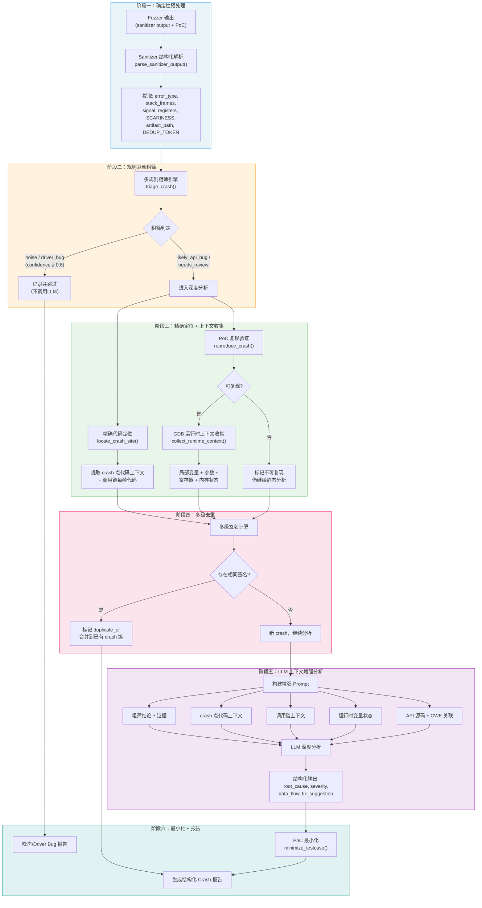

# 增强型 Crash 分析系统 — 论文核心创新点

## 一、研究动机 (Motivation)

现有 LLM 辅助模糊测试框架（如 CKGFuzzer）在 crash 分析阶段存在以下不足：

1. **高误判率**：LLM 缺乏结构化证据，常将 fuzz driver 自身质量问题误判为目标库真实漏洞
2. **定位模糊**：仅告知"哪个 fuzz driver 触发了 crash"，未定位到**目标库源码的具体位置**
3. **缺乏可复现性**：没有自动化地用 PoC 复现 crash 并收集运行时上下文
4. **重复分析浪费**：同一 root cause 的多个 crash 被反复分析，耗费 LLM token 和人工时间
5. **分析内容单薄**：仅有 crash 类别 + LLM 文字分析，缺乏 root cause、severity、修复建议等结构化输出

## 二、核心创新点 (Key Contributions)

### 创新点 1：基于规则的多阶段粗筛机制 (Rule-based Multi-stage Triage)

> **解决问题**：LLM 误判率高，将 driver bug 判定为 API bug

**核心思想**：在调用 LLM 之前，先用确定性规则引擎进行粗筛，过滤掉 fuzz driver 自身质量问题导致的 crash。

**技术路线**：
- 解析 sanitizer 结构化输出（error type, stack frames, SCARINESS score, registers）
- 计算 driver_frame_ratio（driver 栈帧占比）
- 应用多条规则进行证据收集与置信度评估
- 只有通过粗筛（判定为潜在真实漏洞）的 crash 才进入 LLM 深度分析

**规则示例**：
| 规则 | 条件 | 判定 | 置信度 |
|------|------|------|--------|
| R1 | 无 sanitizer 栈帧，仅 deadly signal | noise | 0.9 |
| R2 | driver_frame_ratio ≥ 0.8 | driver_bug | 0.85 |
| R3 | use-of-uninitialized-value + driver 帧 | driver_bug | 0.9 |
| R4 | heap-buffer-overflow + API 帧在栈顶 | likely_api_bug | 0.95 |
| R5 | null-deref + SCARINESS ≥ 10 + API 帧 | likely_api_bug | 0.9 |
| R6 | timeout + 无内存错误 | low_value | 0.7 |
| R10 | stack-buffer-overflow + crash 帧在 driver 内 | driver_bug | 0.92 |
| R11 | 全部非运行时帧均为 driver，无项目帧 | driver_bug | 0.95 |
| R12 | 仅 1-2 个 project 帧 + init/create 浅层调用 | driver_bug | 0.70 |
| R13 | 内存泄漏检测（非 crash） | low_value | 0.65 |

> **共 13 条规则**，覆盖：noise 过滤、driver 质量检测、API 漏洞识别、低价值 crash 标记。

### 创新点 2：精确代码定位与调用链上下文重建 (Precise Localization & Call-chain Context)

> **解决问题**：分析报告不告诉你 crash 出现在目标库的哪一行代码

**技术路线**：
- 从 ASan/MSan 的栈回溯中提取精确的 file:line:column 信息
- 自动读取源文件，提取 crash 点及其前后 N 行代码上下文
- 沿调用栈向上回溯，为每个关键栈帧提取代码上下文
- 重建完整的 **调用链上下文**（caller → callee → crash point）
- 区分 project 帧与 runtime/driver 帧，只关注有价值的调用路径

### 创新点 3：动态调试器集成的运行时上下文收集 (GDB-based Runtime Context Collection)

> **解决问题**：静态分析无法获知 crash 时刻的变量值和内存状态

**技术路线**：
- 用 PoC 输入 + GDB 自动化脚本复现 crash
- 在 crash 点自动收集：局部变量值、函数参数、寄存器状态、关键指针指向的内存
- 沿调用栈每一帧收集上下文
- 将运行时状态与代码上下文融合，形成完整的"crash 现场快照"

### 创新点 4：上下文增强的 LLM 深度分析 (Context-enriched LLM Analysis)

> **解决问题**：LLM 分析信息不足导致判断错误、分析内容单薄

**技术路线**：
- 将粗筛结论、精确定位、调用链上下文、运行时状态、CWE 关联 **全部整合** 到 LLM prompt
- 要求 LLM 输出 **结构化 JSON**：root_cause type/location/trigger_condition、severity、data_flow、fix_suggestion
- 当粗筛判定为 driver_bug 时，引导 LLM 分析 driver 代码问题，避免错误归因到 API
- 当粗筛判定为 likely_api_bug 时，提供 API 代码上下文，引导精确定位 root cause

### 创新点 5：多级签名的 Crash 自动去重 (Multi-level Signature Deduplication)

> **解决问题**：同一 root cause 多次触发，重复分析浪费资源

**技术路线**：
- **Level 1 — 精确签名**：直接使用 libFuzzer DEDUP_TOKEN（如果有）
- **Level 2 — 栈签名**：error_type + top-N API 帧函数名的 SHA256 哈希
- **Level 3 — 模糊签名**：error_type + crash 所在函数名（忽略行号差异）
- 首先用 Level 1 精确去重，然后用 Level 2/3 进行簇聚合
- 每个 crash 簇只做一次完整的 LLM 分析，其余标记为 duplicate_of

### 创新点 6：PoC 复现验证与测试用例最小化 (Reproduction & Minimization)

> **解决问题**：crash 可能不可复现，大 PoC 难以分析

**技术路线**：
- 用原始 PoC 多次复现 crash，计算 repro_rate
- 使用 libFuzzer `-minimize_crash=1` 进行初步最小化
- 对于 libFuzzer 最小化失败的情况，实现 Python 层面的 delta debugging
- 验证最小化后的 PoC 仍触发相同签名的 crash
- 只有可复现的 crash 才进入深度分析流程

## 三、系统架构流程图



## 四、与现有方法的对比

| 维度 | 原始 CKGFuzzer | 本文方法 |
|------|---------------|---------|
| Crash 预处理 | 无，直接送 LLM | 确定性 sanitizer 解析 + 结构化摘要 |
| 误判过滤 | 无 | 13 条规则引擎粗筛，过滤 driver bug 和噪声 |
| 代码定位 | 仅知道哪个 driver | 精确到目标库源码 file:line + 代码片段 |
| 上下文信息 | 仅 crash_info 原文 | 调用链上下文 + GDB 运行时状态 |
| LLM 分析质量 | 文本自由输出 | 结构化 JSON（root_cause/severity/fix） |
| Crash 去重 | 无 | 多级签名（DEDUP_TOKEN → 栈哈希 → 模糊签名） |
| 可复现性 | 不验证 | 多次复现 + repro_rate 统计 |
| 测试用例 | 原始 PoC | 最小化后的 PoC |
| 最终报告 | 6 个字段 | 20+ 结构化字段 |
| Prompt 长度控制 | 无 | 各 section 截断 + 总量安全阈值 |

## 五、初步实验结果（c-ares 回测数据）

> 以下数据来自对已有 c-ares 项目 13 个 crash 的离线回测分析。
> 使用 `crash.retroanalyze` 脚本，**不调用 LLM**，仅运行确定性分析阶段。

### 5.1 粗筛误判率对比 (RQ1)

| 指标 | 原始 CKGFuzzer | 增强方法 |
|------|---------------|---------|
| 判定为 API bug | 12 / 13 (92.3%) | 7 / 13 (53.8%) |
| 判定改变数 | — | 7 / 13 (53.8%) |
| 估算旧版 FP 率 | **41.7%** | — |

**关键发现**：原始 LLM 将 12 个 crash 中的 5 个错误判定为 API bug（实际为 deadly signal 噪声或内存泄漏），增强系统的规则引擎正确将它们过滤为 noise/low_value。

### 5.2 粗筛标签分布

| Triage 标签 | 数量 | 比例 |
|-------------|------|------|
| noise (deadly signal / leak) | 6 | 46.2% |
| likely_api_bug | 6 | 46.2% |
| needs_review | 1 | 7.7% |

### 5.3 LLM 调用节省 (RQ2 效率)

| 指标 | 值 |
|------|-----|
| 可省略 LLM 调用 | 6 / 13 (46.2%) |
| 节省原因 | 3x deadly signal (no ASan stack), 3x LeakSanitizer |

### 5.4 去重效果 (RQ3)

| 指标 | 值 |
|------|-----|
| 总 crash 数 | 13 |
| 去重后唯一 crash | 4 |
| 去重缩减率 | **69.2%** |

**说明**：多级签名机制将 13 个 crash 合并为 4 个唯一簇，避免对同一 root cause 重复分析。

### 5.5 典型 Case Study

**Case: deadly signal 误判**
- 原始判定：`is_api_bug=True, category=Segment Violation`
- 粗筛判定：`label=noise, rule=no_asan_stack, confidence=0.9`
- 原因：crash_info 仅含 `libFuzzer: deadly signal`，无 ASan 栈帧，无法确认 crash 位置
- 结论：旧版 LLM 在无证据时仍倾向于判定为 API bug，增强系统正确过滤

**Case: LeakSanitizer 误判**
- 原始判定：`is_api_bug=True, category=Memory Leak`
- 粗筛判定：`label=noise, rule=leak_only, confidence=0.65`
- 原因：内存泄漏不是 crash 或内存安全漏洞，优先级低

**Case: 真实 API bug 保留**
- 原始判定：`is_api_bug=True`
- 粗筛判定：`label=likely_api_bug, rule=api_memory_error, confidence=0.95`
- 定位：`ares_init.c:428 → init_by_options()` (heap-use-after-free / double-free)
- 结论：增强系统正确保留了真实漏洞并提供了精确定位

## 六、预期实验评估方向（完整实验计划）

### 实验方法论

**核心策略：离线回测 + 增量 fuzzing**

不需要对所有项目从头重跑 fuzzing。已有的 crash 数据中保留了完整的 `crash_info`（sanitizer 原始输出），
可以直接用 `crash.retroanalyze` 脚本进行离线回测，获取对比数据。

```bash
# 对已有数据做回测（无需 LLM，秒级完成）
python -m crash.retroanalyze --crash-dir external_database/c-ares/crash --output results/c-ares_retro.yaml
python -m crash.retroanalyze --crash-dir external_database/cjson/crash  --output results/cjson_retro.yaml
# ... 对每个项目重复
```

**评估维度：**

1. **误判率对比 (RQ1)**：
   - 对比原始 LLM `is_api_bug` 判定 vs 增强系统 triage 判定
   - 人工标注 ground truth（对回测结果中 judgment_changed 的条目逐一验证）
   - 计算 precision/recall/F1

2. **定位精度 (RQ2)**：
   - 统计增强系统能定位到 `file:line` 的 crash 比例
   - 对比：原始系统 0%（仅知道 driver），增强系统 N%

3. **去重效果 (RQ3)**：
   - 统计每个项目的 dedup reduction ratio
   - 统计节省的 LLM 调用比例

4. **分析质量 (RQ4)**：
   - 选 3-5 个典型 Case Study，展示增强 pipeline 完整输出
   - 对比原始 LLM 分析 vs 增强分析的内容丰富度

### 实验项目选择

| 项目 | 已有 crash 数 | 优先级 |
|------|-------------|--------|
| c-ares | 13 | ★★★ 已完成回测 |
| cJSON | 待确认 | ★★★ 小项目，适合快速验证 |
| curl | 待确认 | ★★ 大项目，crash 可能更多 |
| Little-CMS | 待确认 | ★ 补充 |

## 六、论文框架建议 (CCF-B 级别)

1. **Introduction**: LLM-assisted fuzzing 的 crash 分析痛点
2. **Background**: Sanitizer 机制、LLM for vulnerability analysis
3. **Approach**: 六阶段增强分析流程（上图）
4. **Implementation**: 基于 CKGFuzzer 的系统实现
5. **Evaluation**:
   - RQ1: 粗筛能否有效降低误判率？
   - RQ2: 精确定位 + 上下文增强是否提升 LLM 分析质量？
   - RQ3: 去重效果如何？节省多少分析资源？
   - RQ4: 端到端 case study
6. **Related Work**: Crash triage (AFL-tmin, ClusterFuzz), LLM for SE
7. **Conclusion**
